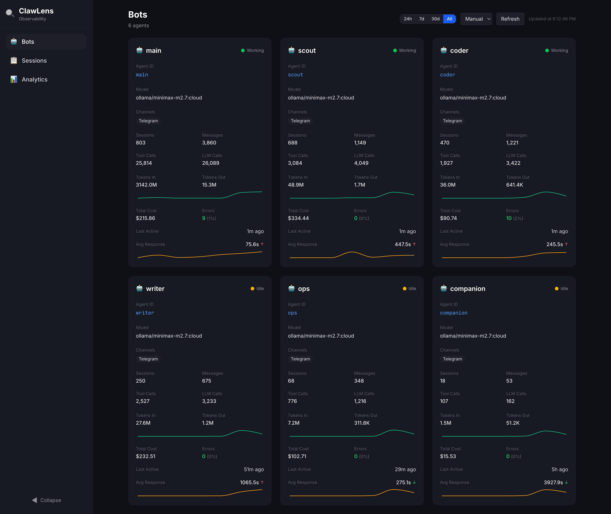
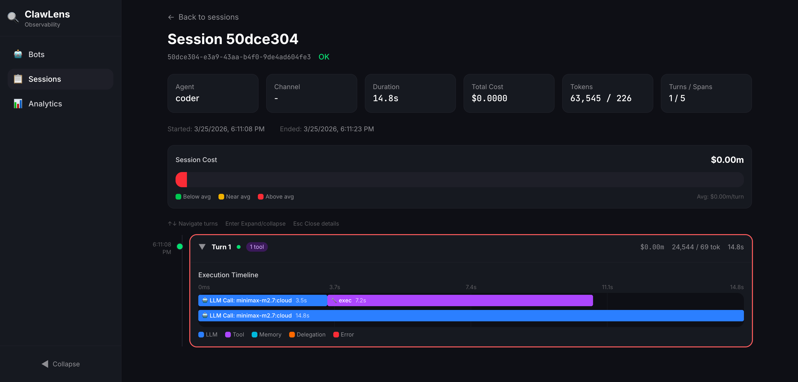
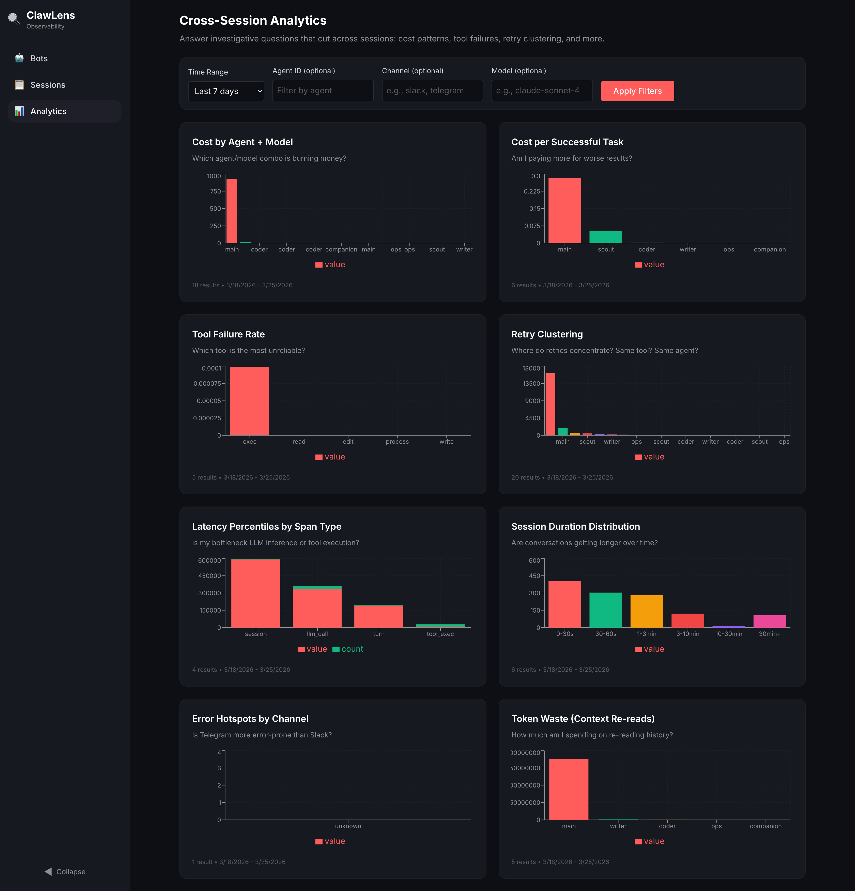
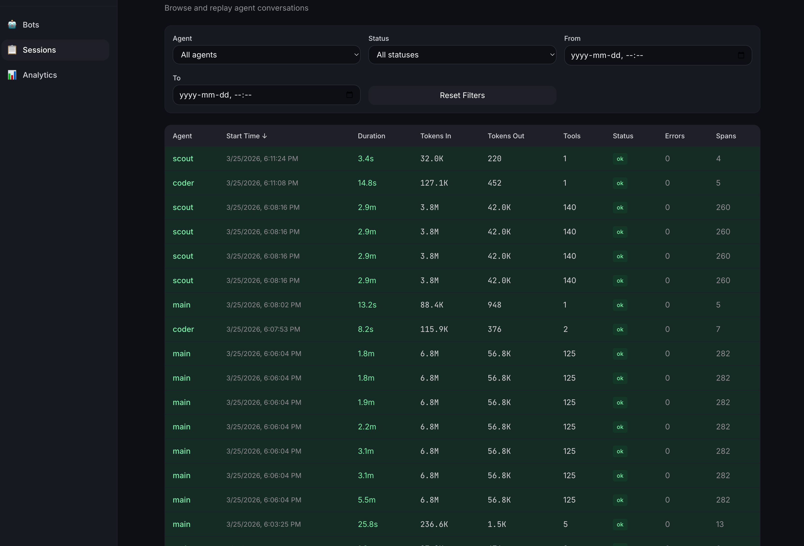

# ClawLens

> **The investigation layer for OpenClaw** — understand _why_ your agents behave the way they do

[](LICENSE)
[](https://github.com/iiizzzyyy/clawlens/actions)

---

## What is ClawLens?

ClawLens is an **investigation and debugging tool** for OpenClaw — purpose-built to answer "why did my agent do that?" rather than just "what happened?" It captures every session, turn, LLM call, and tool execution, then lets you **monitor agent health at a glance**, **replay conversations turn-by-turn**, and **query patterns across sessions**. Unlike monitoring dashboards that show metrics, ClawLens shows you the _why_ behind cost spikes, failures, and unexpected behavior.


*At-a-glance overview of all your agents with live status, token sparklines, and delegation relationships*


*Step through any conversation turn-by-turn with cost, token, and timing annotations*


*Cross-session investigative queries: cost patterns, tool failures, latency percentiles*


*Browse and filter all sessions with sortable columns*

<!-- TODO: capture screenshot → docs/screenshots/cron-jobs.png -->
<!-- TODO: capture screenshot → docs/screenshots/live-flow.png -->

---

## Installation

### Prerequisites

- **OpenClaw** v2026.2 or later
- **Node.js** — must match OpenClaw's runtime Node version for native module compatibility (check with `/opt/homebrew/bin/node --version`)
- **pnpm** v8+

### Install from source

```bash
# 1. Clone the repository
git clone https://github.com/iiizzzyyy/clawlens.git
cd clawlens

# 2. Install dependencies
pnpm install

# 3. Build and deploy (automatically finds Node 22, rebuilds native modules)
pnpm deploy:openclaw
```

The deploy script handles building, copying to the extensions directory, installing production dependencies, and rebuilding `better-sqlite3` for the system Node version.

<details>
<summary>Manual installation (if you prefer)</summary>

```bash
# Build the plugin and UI
pnpm build

# Copy to OpenClaw extensions directory
mkdir -p ~/.openclaw/extensions/clawlens
cp -r packages/plugin/dist/* ~/.openclaw/extensions/clawlens/dist/
cp packages/plugin/package.json ~/.openclaw/extensions/clawlens/
cp packages/plugin/openclaw.plugin.json ~/.openclaw/extensions/clawlens/

# Install runtime dependencies
cd ~/.openclaw/extensions/clawlens && npm install --production

# Rebuild native modules for OpenClaw's Node version
npm rebuild better-sqlite3
```

**Important:** The `npm rebuild` step must use the same Node version that OpenClaw runs (the system Node at `/opt/homebrew/bin/node`).
</details>

### Configure OpenClaw

Add ClawLens to your OpenClaw config (`~/.openclaw/openclaw.json`):

```json
{
  "plugins": {
    "allow": ["clawlens"],
    "entries": {
      "clawlens": {
        "source": "path",
        "sourcePath": "/path/to/clawlens/packages/plugin",
        "installPath": "~/.openclaw/extensions/clawlens",
        "version": "0.1.0",
        "enabled": true
      }
    }
  }
}
```

### Verify

Restart OpenClaw, then open:

```
http://127.0.0.1:18789/clawlens/
```

ClawLens automatically captures sessions and backfills existing JSONL session history.

---

## Features

### 🤖 **Bots Dashboard**

At-a-glance overview of all your agents. Each agent card shows:

- **Live status** — Working, Online, Idle, or Offline (based on last activity)
- **Session & message counts** — Total sessions, messages, tool calls, LLM calls
- **Token usage** — Input/output tokens with 7-day sparkline charts
- **Cost & errors** — Total spend and error rate with color-coded indicators
- **Response time** — Average response time with trend arrows and sparklines
- **Delegation relationships** — Which agents delegate to/from each other, with success rates
- **Model & channel info** — What model each agent uses, which channels it operates on
- **Date range filtering** — Filter stats by 24h, 7d, 30d, or all time
- **Click to explore** — Click any agent card to jump to its sessions, pre-filtered by agent and time period

### 🔍 **Session Replay**

Step through any agent conversation turn-by-turn with full cost, token, tool execution, and timing annotations. See exactly where your agent went wrong.

- Turn-by-turn vertical timeline with user/assistant message previews
- Tool execution waterfall per turn (LLM calls, tool executions, memory searches)
- Running cost accumulator with per-turn cost bar
- Drill into any LLM call or tool execution via span detail panel
- Keyboard navigation (arrow keys, Enter to expand, Esc to close)
- **Export & Share** — Download any session as self-contained HTML or JSON (see below)

### 📤 **Export & Share**

Export any session replay for sharing in bug reports, Notion docs, or GitHub issues:

- **HTML export** — Self-contained, interactive HTML file (dark theme, collapsible turns, no server needed)
- **JSON export** — Raw session span tree for scripting and automation
- Export button in the Replay page header

### 📋 **Session List**

Browse all sessions with filtering and sorting:

- Filter by agent, status, and date range
- Sortable columns: Agent, Start Time, Duration, Tokens In, Tokens Out, Tools, Status, Errors, Spans
- Click any session to open the full replay view


### 📊 **Cross-Session Analytics**

Answer investigative questions that cut across sessions:

- **Cost by agent/model** — "Which combination is burning money?"
- **Cost per successful task** — "Am I paying more for worse results?"
- **Tool failure rate** — "Which tool is the most unreliable?"
- **Retry clustering** — "Where do retries concentrate?"
- **Latency percentiles** — "Is my bottleneck LLM inference or tool execution?"
- **Token waste** — "How much am I spending on re-reading history?"
- Time-range filtering on all queries
- Sequential card loading to prevent backend overload


### ⏰ **Scheduled Jobs Dashboard**

Monitor all cron-triggered agent workflows in one place:

- **Summary strip** — Active jobs, failing count, next run countdown, estimated daily cost
- **Sortable job table** — Status badges, schedule, duration, cost, and history sparkline dots
- **Expandable rows** — Job metadata and last 20 runs with session replay deep-links
- **Filters** — Search by name, filter by agent, status (All / OK / Failing / Disabled)
- **Auto-refresh** — Configurable polling (Manual, 30s, 1m, 5m)
- Reads directly from OpenClaw cron JSONL run files — no extra configuration

<!-- TODO: capture screenshot → docs/screenshots/cron-jobs.png -->

### 🌊 **Live Flow Dashboard**

Real-time agent activity dashboard with three stacked sections:

- **Stats strip** — Five live counters: active sessions, total cost, tokens in/out, errors, avg latency
- **Agent cards** — Per-agent breakdown with LLM/tool counts, cost sparkline, model badge, active/idle status, and "Sessions" deep-link
- **Enriched event feed** — Color-coded event rows with timestamp, span type, name, duration, cost, and agent ID
- **Detail panel** — Click any event to see full span info (model, tokens, duration, cost, session, error) with action buttons: Open Replay, Filter Agent, Filter Session, Filter Type
- **Filter bar** — Narrow the feed by agent, session, or span type; clear with one click
- Uses polling (2s interval) for compatibility with the OpenClaw gateway

<!-- TODO: capture screenshot → docs/screenshots/live-flow.png -->

### 📝 **Logs**

Color-coded live log viewer for agent activity:

- **Level filtering** — Toggle error, warn, info, debug log levels
- **Agent filtering** — Filter logs by specific agent
- **Text search** — Free-text search across log messages
- **Auto-scroll** — Follows new log entries with manual scroll override

<!-- TODO: capture screenshot → docs/screenshots/logs.png -->

### 🧠 **Memory Browser**

Browse and track changes to agent workspace files:

- **File tree sidebar** — Navigable directory tree of agent memory files
- **Content viewer** — View current file contents with syntax highlighting
- **Snapshot history** — Timeline of file changes with timestamps
- **Diff viewer** — Compare any two snapshots to see what changed

<!-- TODO: capture screenshot → docs/screenshots/memory-browser.png -->

---

## How It Works

ClawLens runs as an **OpenClaw plugin** inside the Gateway process. No separate services, no Docker, no orchestration.

```
                     OpenClaw Gateway
 ┌────────────────────────────────────────────────┐
 │                                                │
 │  Channels ──▶ Agent Runtime ──▶ Tools          │
 │                     │                          │
 │              Lifecycle Hooks                   │
 │                     │                          │
 │       ┌─────────────▼──────────────┐           │
 │       │     ClawLens Plugin        │           │
 │       │                            │           │
 │       │  Capture ──▶ SQLite (WAL)  │           │
 │       │  Query   ──▶ REST API      │           │
 │       │  Serve   ──▶ React UI      │           │
 │       │  Import  ◀── JSONL files   │           │
 │       │  Cron   ◀── JSONL run logs │           │
 │       │  Config  ◀── openclaw.json │           │
 │       └────────────────────────────┘           │
 └────────────────────────────────────────────────┘
```

- **Live capture**: Lifecycle hooks write spans to SQLite (WAL mode) in real-time
- **Historical backfill**: Existing JSONL session files are imported on first startup
- **Agent config**: Reads `openclaw.json` to populate the Bots dashboard with agent metadata
- **Web UI**: Static React app served at `/clawlens` with configurable auto-refresh

---

## Configuration

Create `clawlens.config.yaml` in your OpenClaw workspace root:

```yaml
clawlens:
  enabled: true
  db_path: ~/.openclaw/clawlens/clawlens.db
  retention_days: 90
  backfill_on_start: true
  exclude_agents: []
  exclude_channels: []
```

### Configuration Options

| Field | Type | Default | Description |
|-------|------|---------|-------------|
| `enabled` | boolean | `true` | Enable/disable the plugin |
| `db_path` | string | `~/.openclaw/clawlens/clawlens.db` | SQLite database location |
| `retention_days` | number | `90` | Auto-prune spans older than N days |
| `backfill_on_start` | boolean | `true` | Import existing JSONL sessions on startup |
| `sessions_dir` | string | `~/.openclaw/agents` | Directory containing JSONL sessions |
| `exclude_agents` | string[] | `[]` | Agent IDs to skip capturing |
| `exclude_channels` | string[] | `[]` | Channels to skip capturing |
| `verbose` | boolean | `false` | Enable verbose logging |
| `demo` | boolean | `false` | Auto-load demo sessions for exploration |

---

## API Endpoints

ClawLens exposes a REST API at `/clawlens/api/`:

| Endpoint | Description |
|----------|-------------|
| `GET /clawlens/api/bots` | Agent overview (supports `fromTs`, `toTs` params) |
| `GET /clawlens/api/sessions` | Session list (supports filtering and pagination) |
| `GET /clawlens/api/sessions/:id/replay` | Full session span tree for replay |
| `GET /clawlens/api/sessions/:id/summary` | Session summary stats |
| `GET /clawlens/api/sessions/:id/export` | Export session as HTML or JSON (`?format=html\|json`) |
| `GET /clawlens/api/analytics/:queryType` | Analytics queries (15+ query types) |
| `GET /clawlens/api/analytics` | List available query types |
| `GET /clawlens/api/cron/jobs` | Cron job list with run stats |
| `GET /clawlens/api/cron/jobs/:id/runs` | Paginated run history for a job |
| `GET /clawlens/api/cron/summary` | Aggregate cron summary |
| `GET /clawlens/api/flow/events` | Live flow events (polling, `?since=` timestamp) |
| `GET /clawlens/api/logs/stream` | Log stream (SSE) |
| `GET /clawlens/api/memory/files` | List agent memory files |
| `GET /clawlens/api/memory/history` | Snapshot history for a file |
| `GET /clawlens/api/memory/diff` | Diff between two snapshots |

---

## Development

```bash
# Install dependencies
pnpm install

# Build everything
pnpm build

# Run tests
pnpm test

# Type checking
pnpm typecheck

# Lint
pnpm lint
```

### Project Structure

```
clawlens/
├── packages/
│   ├── plugin/          # OpenClaw plugin (backend)
│   │   ├── src/
│   │   │   ├── api/     # HTTP route handlers
│   │   │   ├── cron/    # Cron job reader and queries
│   │   │   ├── db/      # SQLite queries and schema
│   │   │   ├── config/  # OpenClaw config reader
│   │   │   ├── hooks/   # Lifecycle hook handlers
│   │   │   └── index.ts # Plugin entry point
│   │   └── package.json
│   └── ui/              # React web UI (frontend)
│       ├── src/
│       │   ├── pages/   # Bots, SessionList, Replay, Analytics, CronJobs, Flow, Logs, Memory
│       │   ├── components/
│       │   ├── hooks/
│       │   ├── utils/   # Formatting utilities
│       │   └── api/     # Typed API client
│       └── package.json
├── docs/                # Documentation
└── README.md
```

---

## Documentation

- [Architecture Guide](docs/architecture.md) — How ClawLens works under the hood
- [Event Schema](docs/event-schema.md) — Span types and field reference
- [Contributing Guide](docs/contributing-guide.md) — How to add features and fix bugs
- [Roadmap](docs/roadmap.md) — Current status and future direction

---

## Contributing

We welcome contributions! See [CONTRIBUTING.md](CONTRIBUTING.md) for full details.

```bash
# Quick dev setup
pnpm install && pnpm build
```

---

## Why ClawLens?

OpenClaw has great OTEL metrics and ClawMetry for cost tracking, but when something goes wrong, you're left **grep-ing JSONL files** or **staring at aggregate metrics**. ClawLens fills the gap:

| Capability | ClawLens | ClawMetry | Raw OTEL | JSONL Files |
|-----------|----------|-----------|----------|-------------|
| Agent overview dashboard | ✅ | ❌ | ❌ | ❌ |
| Session replay with cost annotation | ✅ | ❌ | ❌ | Manual |
| Cross-session investigative queries | ✅ | Partial | ❌ | ❌ |
| Tool execution waterfall | ✅ | ❌ | Partial | ❌ |
| Agent delegation tracking | ✅ | ❌ | ❌ | ❌ |
| Works without OTEL enabled | ✅ | ❌ | ❌ | ✅ |
| Historical backfill | ✅ | ❌ | ❌ | N/A |
| Scheduled job monitoring | ✅ | ❌ | ❌ | ❌ |
| Zero-config install | ✅ | ✅ | ❌ | N/A |

---

## License

Apache-2.0 — see [LICENSE](LICENSE)

---

## Acknowledgments

Built for the OpenClaw community. Special thanks to the plugin SDK maintainers for making plugin-native observability possible.
